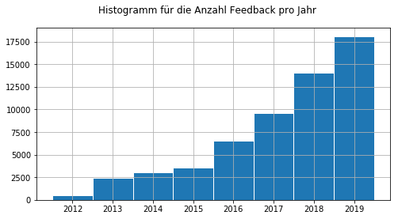
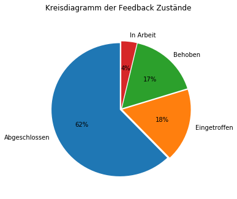
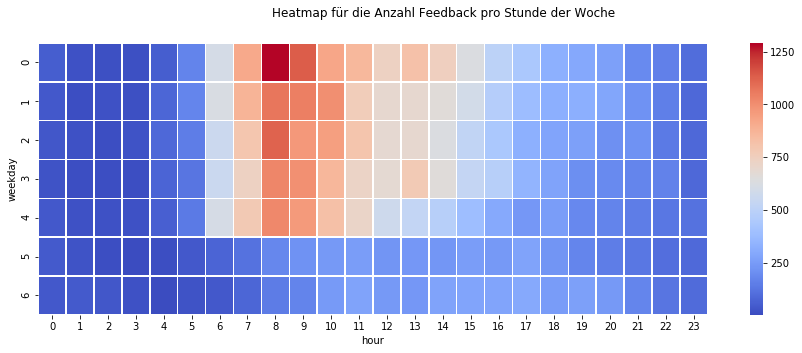

## KA-Feedback

### Ziel

Analyse der von der Website [feedback.karlsruhe.de](https://feedback.karlsruhe.de/) generierten Daten, mit deren Hilfe die Bürger die Gemeinde über bestimmte Situationen im öffentlichen Raum informieren können. 

### Ergebnisse

##### Das Feedback-System wird immer häufiger verwendet:

##### Übersicht über Art und Status des Feedbacks:

##### Feedback wird am häufigsten vormittags gegeben, insbesondere am Montag:

### Beschreibung der Dateien

__[Data_Analysis.ipynb](Data_Analysis.ipynb)__ -
Analyse und Vorverarbeitung der `data/*.csv`-Dateien.

__[utilities.py](utilities.py)__ -
Python-Skript mit benutzerdefinierten Hilfsfunktionen.