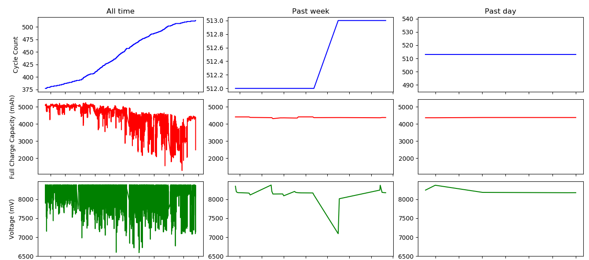

## Laptop Battery Monitor (for MacOS X)

### Purpose
To report on historic data for three battery KPIs
- Cycle Count
- Full Charge Capacity (mAh)
- Voltage (mV)

### Demonstration

Track the status of these parameters by opening the file `BatteryReport.png` in a web-browser.

### Description of files

__[local.batterymonitor.plist](local.batterymonitor.plist)__ -
MacOS launchd program. 
To be edited (replace `PATH_TO_SCRIPT`) and to be placed in `~/Library/LaunchAgents`. 
Launches the following script (.sh) every hour (at minute = 0).
More info: http://www.launchd.info/

__[BatteryMonitor.sh](BatteryMonitor.sh)__ -
Queries information on the battery from the system_profiler command. 
Appends the information to the text file (.txt). 
Runs the follow python script (.py) to update the images with plots (.png).

__[BatteryMonitorData.txt](BatteryMonitorData.txt)__ -
Text file containing historic data.

__[CreateReport.py](CreateReport.py)__ -
Python script for generating plot of the data.

__[BatteryReport.png](BatteryReport.png)__ -
Plots of historic data in a 3x3 grid:
- Vertical: three KPIs: Cycle Count, Full Charge Capacity (mAh), Voltage (mV).
- Horizontal: three time-windows: All time, Past week, Past day.
