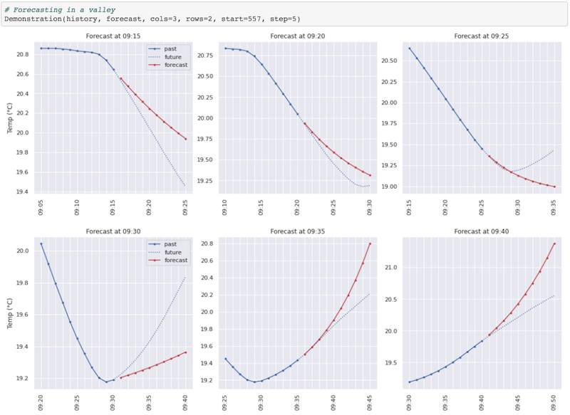
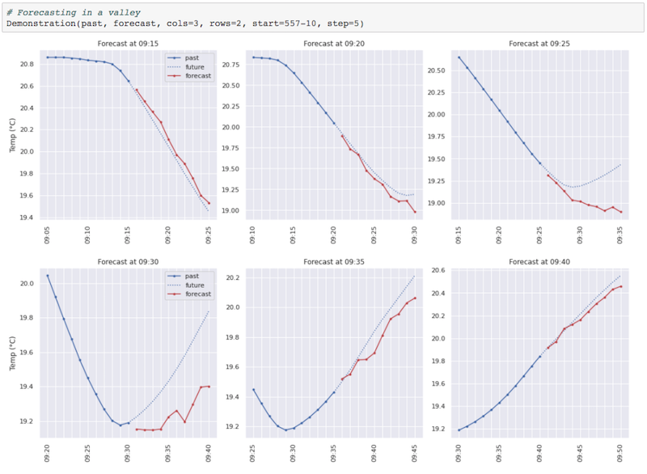
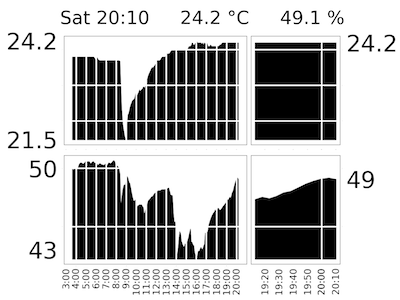

## Microclimate Forecaster

### Purpose

To forecast the living room temperature based on historical values.
Mathematical and deep-learning models are developed and compared with one another.

### Demonstration

#### 1. Forecast from mathematical model (DES):

#### 2. Forecast from deep learning model (RNN):

#### 3. Temperature display:
The temperature measurements are taken with a digital relative humidity and temperature sensor DHT22 connected to a Raspberry Pi and displayed on 4.2" e-Paper display, as shown below.

### Description of files

__[temp1-data-preparation.ipynb](temp1-data-preparation.ipynb)__ -
A Jupyter notebook for importing raw sensor data from a csv file, pre-processing data (to remove outliers, impute missing values and smoothen the sensor values) and exporting the results to `time_series.csv'. [(pdf version, 4 pages)](output/temp1-data-preparation.pdf)

__[temp2-mathematical-models.ipynb](temp2-mathematical-models.ipynb)__ -
A Jupyter notebook for developing a few simple mathematical models to forecast the time-series data provided by `time_series.csv'. The performance of these models serve as benchmark for the machine learning models: 7.2% error on 10-step forecast. [(pdf version, 14 pages)](output/temp2-mathematical-models.pdf)

__[temp3-machine-learning-models.ipynb](temp3-machine-learning-models.ipynb)__ -
A Jupyter notebook for developing a machine learning models to forecast the same time-series data provided by `time_series.csv'. The best model that was selected employs both Conv1D and LSTM layers and achieves an error of 5.6% error on 10-step forecast. [(pdf version, 22 pages)](output/temp3-machine-learning-models.pdf)

__[temp4-comparison.ipynb](temp4-comparison.ipynb)__ -
A Jupyter notebook for carrying out a more detailed comparison between the best DES and RNN models in the temp2 and temp3 notebooks, respectively. The analysis suggests that an ensemble of both DES and RNN would achieve best performance. [(pdf version, 5 pages)](output/temp4-comparison.pdf)

 

__[scripts / temp-utilities.py](input/temp-utilities.py)__ -
Python script with custom helper functions for dealing with time series.

__[scripts / temp-math-scripts.py](input/temp-math-scripts.py)__ -
Python script with custom helper functions for the mathematical models.

__[scripts / temp-ml-scripts.py](input/temp-ml-scripts.py)__ -
Python script with custom helper functions for the machine learning models.

__[data / time_series.csv](output/time_series.csv)__ -
Text file containing pre-processed time-series data.
